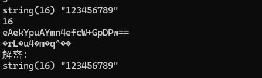
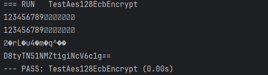

# go-openssl
go 实现php版本的openssl加密&amp;解密


# openssl_encrypt
`openssl_encrypt($data, 'AES-128-ECB', $key, $options = 0, $iv = '')`
- 128 在PHP中如果key的长度小于16，则php会自动补全(`\0`)；大于16位的key，则php会自动截取前16位 
- 192 同上key长度为：24
- 256 同上key长度为：32
### AES-128-ECB、AES-192-ECB、AES-256-ECB 
```php
// 在php中ECB是不支持iv，所以对于ECB加密来说其实只有前4个参数有效
openssl_encrypt($data, 'AES-128-ECB', $key, $options = 0)

// 加密时$options为0(OPENSSL_RAW_DATA)
openssl_decrypt(base64_decode($data), 'AES-128-ECB', $key, $options = 0)
```
- 加密时$options为0，解密时$options=OPENSSL_RAW_DATA 
- 加密时$options=OPENSSL_ZERO_PADDING，解密时$options=OPENSSL_RAW_DATA | OPENSSL_ZERO_PADDING，且加密的数字必须要为`method=AES-128-ECB`的对应倍数，不然会不生效，如果要跨语言通用建议填充`\0`
- OPENSSL_RAW_DATA | OPENSSL_ZERO_PADDING 或 OPENSSL_RAW_DATA | OPENSSL_NO_PADDING

### 关于`$options`的枚举说明
- 0 返回base64编码数据并使用PKCS7填充数据
- OPENSSL_RAW_DATA 返回原始数据，如果key的长度不够使用`NUL`(`\0x00`)填充；数据使用PKCS7填充
- OPENSSL_ZERO_PADDING 返回base64，如果key的长度不够使用`NUL`(`\0x00`)填充；编码数据并使用`\0`(`chr(0)`)填充数据【**不推荐**】
- OPENSSL_NO_PADDING 需要自己实现数据的填充来满足key的16、24、32位倍数

### 关于`OPENSSL_ZERO_PADDING`填充在php和go中差异
- php中使用`\0`(`chr(0)`)填充，使用`echo/var_dump`无法显示填充的字符，但是其长度是在的  

- go中使用`\0`会显示   

上面的情况就会导致一个问题相同的数据，相同的key使用`OPENSSL_ZERO_PADDING`加密后，php与go加密结果不一样，但是不影响解密。（不推荐使用此填充方式）
# 已经实现的加密解密方法
- [x] AES-128-CBC
- [x] AES-192-CBC
- [x] AES-256-CBC
- [x] AES-128-ECB
- [x] AES-192-ECB
- [x] AES-256-ECB